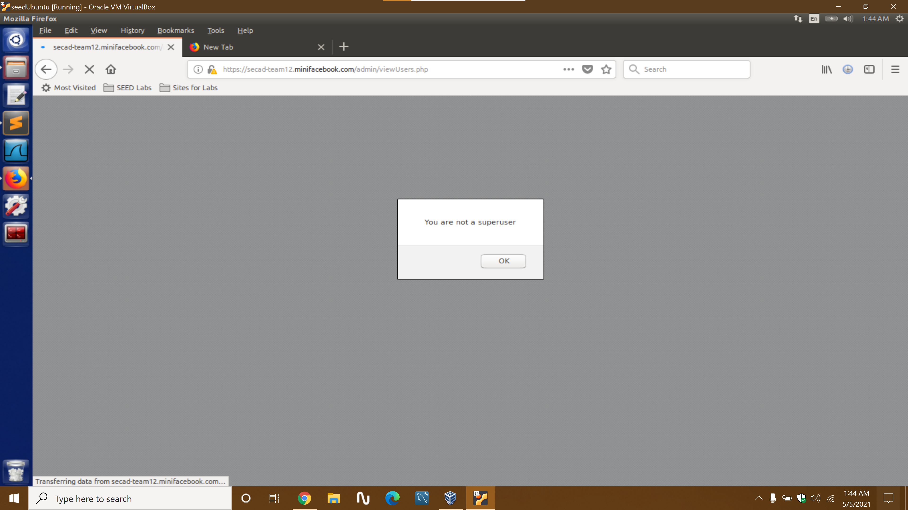

# README #  

##Course Information 

CPS 475/575 Secure Application Development  

##Instructor name 

 Dr Phu Phung

###Secad Project Team-12

###AUTHORS:     

Karthik Nimma (nimmak1@udayton.edu) Student Id - 101650589  

Mrigank Pandey (pandeym1@udayton.edu) Student Id - 101671124  


https://udayton.zoom.us/rec/play/5sLT6TVWxpQXTyI2zWX82lx7Lk9TPf6s69UK2o8FhGP3OAXTBv2ixq9_d8F15CJL7VzmJrybyKWgAEgw.EYeMHvkcAo5R46Rq?continueMode=true

https://youtu.be/GYmF-a0ps0g


# 1. Introduction

https://bitbucket.org/secad-project-2021/

This project is a  very simple bare implementation of a facebook application. The main focus of the project is to develop an application which is robust and immune to the most popular attacks techniques till date. The application is deployed over the secure https which encrypts all traffic to the server.We have used all the defensive techniques taught in this course to safeguard our application.Input validation plays a major role in defending the application as this is how malicious code gets into the application. This application requires users to create an account which will allow the user to make posts and also write comments on his own or other user's posts. The user has the ability to edit/delete his/her posts. The credentials of a super user are inserted directly into a separate table in the database using the  mysql console. He has the ability  to view the list of registered users.


# 2. Design


Database
The database schema contains of four tables i.e super_user, users, posts, comments.

 super_user - username (PrimaryKey) , password  
 users - username, password, user_id(PrimaryKey), fname,lname, email_id, DOB  
 posts - post_id(PrimaryKey), post_msg, user_id( ForeignKey), date_posted  
 comments - comment_id(PK), post_id(FK), comment_msg, user_id(FK), date_posted  
  
  


The 'super_user' table is completely isolated from other tables. The remaining tables are connected and maintain integrity using foreign keys to each other.
Whenever a new account is created, the credentials are inserted into the 'users' table. Whenever a authenticated user makes a post, the information is inserted into the 'posts' table after referencing the 'users' table to find and match the record corresponding to the userid.


The user interface is minimal with basic html tags used to display the ouputs. Ocassionally CSS is used to make the web page appealing and easy to navigate. 

  
Currently, regular users and super users are put in two different tables. The login page for each type of user is different and each page access respective tables based on user type. Moreover, a session variable is used which stores the role of the user. If the session variable has to value 'superuser' only that session can access the admin functionalities such view the list of registered users.


# 3. Implementation & security analysis

Security principles were applied at almost each step of the development process. Security was devised after imagining every possible attack that can be used against the application.Moreover , defense in depth principle was used primarily in every webpage. According to this princple multiple redundant checks are performed both on server and client side to ensure malicious data doesnt go throught the application. Inorder to protect our database, we have used prepared statements which maps a sql query given by the user to hard coded query format. This ensures malicious inputs are not allowed to the database.

Input validation and error messages guide the user towards entering the correct input.Alerts are displayed when something goes wrong and hence the program is robust. Moving on the defense mechanisms of the application, the program is immune to XSS attacks input fields are validated so javascript code cannot be embedded into the forms. SQL injection is a popular attack which tricks the program inorder to gain access to the database. We have used prepared statements which prevents sql injection attacks.We have defended against Cross site request forgery by generating a random value token on one page and storing it in a session variable. This token is then posted to the other webpage where it's value is compared against the session variable. Session hijacking is prevented by not allowing any javascript to steal the cookie data. As a redundancy, we also store the browser information from which the original request was generated.So all following requests to the server must come from the original browser else the server will destroy the session for protection.Database access control is a neccessity to make sure users dont gain access to data which dont belong to them. We have separated the superusers table and regular users table. However , to be more secure we have defined role within a session variable for the superuser. Regular users donot have this and hence cannot access the admin priveleges.


# 4. Demo (screenshots)

*   ### Anyone can register for an account using the registration form.Input is validated and every form field is required.The data is then inserted into the users table.    <br> 


	      <br> <br>


*  ### The user can then login normally like any other user. The program checks the username password provided using  prepared statment for security purpose.     <br>

	       <br> <br>


*  ### A regular cannot access a webpage which belongs to the superuser. For example he cannot visit the page 'viewusers.php' which can only be accessed by superuser. This is thanks to database access role implemented using session variable.     <br>


	     <br> <br>

* ### Cross site forgery is detected when we try to access changepassword.php directly using URL.Hence it is not possible to change password by a attacker. <br>

	     <br> <br>
	
* ###  XSS attack to steak cookies isnt possible as we it is not possible retrieve sessionID stored in cookies.<br>

	     <br> <br>


# Appendix

##Course Information##  

CPS 475/575 Secure Application Development  

###Instructor name###  

 Dr Phu Phung

####Secad Project Team-12####

AUTHORS:   

Karthik Nimma (nimmak1@udayton.edu) Student Id - 101650589  

Mrigank Pandey (pandeym1@udayton.edu) Student Id - 101671124  


## /changepassword.php
```php
<!-- mark as complete -->

<?php
  require 'session_auth.php';
  require 'database.php';

	$username = $_SESSION['username'];
	$nocsrftoken = $_POST["nocsrftoken"];

	if(!isset($nocsrftoken) or ($nocsrftoken!=$_SESSION['nocsrftoken'])){
		echo "<script>alert('Cross site request forgery is detected!');</script>";
		header("Refresh:0;url=logout.php");
		die;
	}

	if(isset($_SESSION["username"]) AND isset($_POST["newpassword"])){
	  	if (empty($_SESSION["username"]) OR empty($_POST["newpassword"])) {

	  		echo "<script>alert('INPUT MISSING');</script>";
			header("Refresh:0;url=logout.php");
			die;
	    }	
		$username = sanitize_input($_SESSION["username"]);
	    if (!preg_match("/^[\w.-]+@[\w-]+(.[\w-]+)*$/",$username)) {
			header("Refresh:0;url=changepasswordform.php");
			die;

	    }	
		$newpassword=sanitize_input($_POST["newpassword"]);
		if (!preg_match("/^(?=.*[a-z])(?=.*[A-Z])(?=.*[0-9])(?=.*[!@#$%^&])[\w!@#$%^&]{8,}$/",$newpassword)) {
	  			regeXCheckFail();
		}	

		// echo "DEBUG:change password.php->Got: Username=$username;newpassword=$newpassword\n<br>";
		if(changepassword($username,$newpassword)){
			echo "<h4> password changed successfully</h4>";
		}else{
			echo "<h4>Error:Cannot change password</h4>";
		}
	}else{
		echo "No provided username/password to change.";
		exit();
	}
	function regeXCheckFail(){
		echo "<script>alert('Password  isnt in correct format.Redirecting now.');</script>";
		header("Refresh:0;url=changepasswordform.php");
		die;
	}
	function sanitize_input($data){
	  $data = trim($data);
	  $data = stripslashes($data);
	  $data = htmlspecialchars($data);
	  return $data;
	}
?>
<a href="index.php">Home</a> | <a href="logout.php">Logout</a>
```
## /form.php
```php
<!DOCTYPE html>
<html lang="en">
<head>
  <meta charset="utf-8">
  <title>Login page - SecAD</title>
</head>
<body>
    <h1>Team Project,Secad</h1>
    <h2>Team 12: Karthik Nimma and Pandey</h2>

<?php
  //some code here
  echo "Current time: " . date("Y-m-d h:i:sa")
?>
          <form action="index.php" method="POST" class="form login">
                Username:<input type="text" class="text_field" name="username" required
                pattern="^[\w.-]+@[\w-]+(.[\w-]+)*$"
                title="Please enter a valid email as username" 
                placeholder="Your email address"
                onchange="this.setCustomValidity(this.validity.patternMismatch?this.title: '');" /> <br>

                Password: <input type="password" class="text_field" name="password" required
                pattern="^(?=.*[a-z])(?=.*[A-Z])(?=.*[0-9])(?=.*[!@#$%^&])[\w!@#$%^&]{8,}$"
                placeholder="Your password"
                title="Password must have at least 8 characters with 1 special symbol !@#$%^& 1 number, 1 lowercase, and 1 UPPERCASE"
                onchange="this.setCustomValidity(this.validity.patternMismatch?this.title: '');"/> <br>
                
                <button class="button" type="submit">
                  Login
                </button>
          </form><br>
          <a href="registrationform.php">Sign Up</a>

</body>
</html>


```
## /editpost.php
```php
<!-- Not Secure. Cannot figure out how to implement security against CSRF -->


</!DOCTYPE html>
<html>
<head>
	<title>Edit Post</title>
</head>
<body>
	<?php $post_id=$_POST["post_id"]; ?>
	<form action="index.php" method="post">
	<div>
	<textarea name="editedpost" id="post" style="font-family:sans-serif;font-size:1.2em;">
	Enter the new post</textarea>
	<input type="hidden" name="post_id" value="<?php echo $post_id; ?>" /> 
	</div>
	<input type="submit" value="Submit">
	</form>

<a href="index.php">Home Page</a>
</body>
</html>
```
## /logout.php
```php
<?php
	session_start();
	session_destroy();
?>
<p> You are logged out! </p>
<a href="form.php">Login again</a>
```
## /deletepost.php
```php
<!-- Not implemented. Cannot figure out how to implement security against CSRF -->

</!DOCTYPE html>
<html>
<head>
	<title>Delete Post</title>
</head>
<body>
	<?php 
	require 'database.php';
	require 'session_auth.php';


	$post_id=$_POST["post_id"];


	 ?>
	<form action="index.php" method="post">
	<div>
	<textarea name="editedpost" id="post" style="font-family:sans-serif;font-size:1.2em;">
	Enter the new post</textarea>
	<input type="hidden" name="post_id" value="<?php echo $post_id; ?>" /> 
	</div>
	<input type="submit" value="Submit">
	</form>

<a href="index.php">Home Page</a>
</body>
</html>
```
## /changepasswordform.php
```php
<!-- Marked as Complete -->


<?php
  require "session_auth.php";
  $rand = bin2hex(openssl_random_pseudo_bytes(16));
  $_SESSION["nocsrftoken"] = $rand;
?>

<!DOCTYPE html>
<html lang="en">
<head>
  <meta charset="utf-8">
  <title>Change Password</title>
</head>
<body>
      	<h1>Change password,SECAD</h1>

<?php
  //some code here
  echo "Current time: " . date("Y-m-d h:i:sa")
?>
          <form action="changepassword.php" method="POST" class="form login">
                Username:<!-- <input type="text" class="text_field" name="username" />  --><?php echo htmlentities($_SESSION['username']); ?><br>
 				 New Password: <input type="password" class="text_field" name="newpassword" required
                pattern="^(?=.*[a-z])(?=.*[A-Z])(?=.*[0-9])(?=.*[!@#$%^&])[\w!@#$%^&]{8,}$"
                placeholder="Your password"
                title="Password must have at least 8 characters with 1 special symbol !@#$%^& 1 number, 1 lowercase, and 1 UPPERCASE"
                onchange="this.setCustomValidity(this.validity.patternMismatch?this.title: ''); form.repassword.pattern =this.value;"/>
                 <br>

				Retype Password: <input type="password" class="text_field" name="repassword"
				placeholder="Retype your password" required
				title="Password does not match"
				onchange="this.setCustomValidity(this.validity.patternMismatch?this.title: '');"/>
				 <br>

                <button class="button" type="submit">
                  Change Password
                </button>
                <input type="hidden" name="nocsrftoken" value="<?php echo $rand; ?>" />
          </form>
          <a href="index.php">Home Page</a>

</body>
</html>


```
## /index.php
```php
<html>
<head>
<meta name="viewport" content="width=device-width, initial-scale=1">
<style>
body {
  margin: 0;
  font-family: Arial, Helvetica, sans-serif;
}

.topnav {
  overflow: hidden;
  background-color: #333;
}

.topnav a {
  float: left;
  color: #f2f2f2;
  text-align: center;
  padding: 14px 16px;
  text-decoration: none;
  font-size: 17px;
}

.topnav a:hover {
  background-color: #ddd;
  color: black;
}

.topnav a.active {
  background-color: #04AA6D;
  color: white;
}
</style>
</head>
<body>


<?php
	$lifetime = 15*60;
	$path = "/";
	$domain = "secad-team12.minifacebook.com";
	$secure = TRUE;
	$httponly = TRUE;
	session_set_cookie_params($lifetime,$path,$domain,$secure,$httponly);
	session_start(); 
	$mysqli = new mysqli('localhost','secad_team12','team12Pass','secad_team12');
		if($mysqli ->connect_errno){
		printf("Database connection failed: %s\n", $mysqli ->connect_error);
		exit();
	}

	// INPUT VALIDATION
	if(isset($_POST["username"]) and isset($_POST["password"])){   

	  	if (empty($_POST["username"]) OR empty($_POST["username"])) {
	  		echo "<script>alert('INPUT MISSING');</script>";
	  		session_destroy();
			header("Refresh:0;url=form.php");
			die;
	    }
		$username = sanitize_input($_POST["username"]);
	    if (!preg_match("/^[\w.-]+@[\w-]+(.[\w-]+)*$/",$username)) {
	      regeXCheckFail();
	    }	
		$password=sanitize_input($_POST["password"]);
	    if (!preg_match("/^(?=.*[a-z])(?=.*[A-Z])(?=.*[0-9])(?=.*[!@#$%^&])[\w!@#$%^&]{8,}$/",$password)) {
	      regeXCheckFail();
	    }
	    // end input validation

		if (secureCheckLogin($username,$password)) {
			$_SESSION["logged"] = TRUE;
			$_SESSION["browser"] = $_SERVER["HTTP_USER_AGENT"];
		
			if(!isset($_SESSION["username"]))
				$_SESSION["username"] = $username;
				
		}else{
			echo "<script>alert('Invalid username/password');</script>";
			session_destroy();
			header("Refresh:0; url=form.php");
			die();
		}
	}	

	if(!isset($_SESSION["logged"]) or $_SESSION["logged"] != TRUE){
			echo "<script>alert('Please login FIRST!');</script>";
			session_destroy();
			header("Refresh:0; url=form.php");
			die();		
	}
	if($_SESSION["browser"] != $_SERVER["HTTP_USER_AGENT"]){
		echo "<script>alert('Sesssion hijacking detected!');</script>";
		session_destroy();
		header("Refresh:0; url=form.php");
		die();
	}
	if(isset($_POST["post"])){
		$nocsrftoken = $_POST["nocsrftoken"];
		if(!isset($nocsrftoken) or ($nocsrftoken!=$_SESSION['nocsrftoken'])){
			echo "<script>alert('Cross site request forgery is detected!');</script>";
			header("Refresh:0;url=logout.php");
			die;
		}
		$_SESSION["post"] = $_POST["post"];
		if (empty($_POST["post"])) {
	  		echo "<script>alert('INPUT MISSING');</script>";
			header("Refresh:0;url=addPost.php");
			die;
	    }
		$post = sanitize_input($_POST["post"]);
	    if (!preg_match("/[A-Za-z]{3,100}/",$post)) {
			echo "<script>alert('INPUT data isnt in correct format.');</script>";
			header("Refresh:0;url=addPost.php");
			die;
	    }else	
	    	addPost($post);


	}

	// INCORRECT FUNCTIONALITY. HENCE,INPUT VALIDATION WAS IGNORED. DONOT USE 
	if(isset($_POST["editedpost"]) AND isset($_POST["post_id"])){
		$editedpost = $_POST["editedpost"];
		$postid = $_POST["post_id"];
		editpost($editedpost,$postid);
	}

	function regeXCheckFail(){
		echo "<script>alert('INPUT data isnt in correct format.Redirecting now.');</script>";
		header("Refresh:0;url=form.php");
		die;
	}
	function sanitize_input($data){
	  $data = trim($data);
	  $data = stripslashes($data);
	  $data = htmlspecialchars($data);
	  return $data;
	}
?>
<h2> Welcome
 <?php 
 	echo htmlentities($_SESSION['username']); 
?> !</h2>

<div class="topnav">
  <a class="active" href="index.php">Home</a>
	<a href="changepasswordform.php">Change password</a>
	<a href="logout.php">Logout</a>
	<a href= "addPost.php">add post</a>
</div>


 
<!-- Puting posts in table -->
 <table id="table" style="width:40%" align="center">
     <tr>
          <th>Posts</th>
     </tr>
     <tr>      
          <?php
             	include 'database.php';
	    		global $mysqli;
	    		$prepared_sql = "select post_id,post_msg from posts;";
	            if(!$stmt = $mysqli->prepare($prepared_sql)){
	                return FALSE;
	            }
	            if(!$stmt->execute()) return false;
	            $post_msg = NULL;
	            $post_id=NULL;
	            if(!$stmt->bind_result($postid,$post_msg)) echo "Binding failed";

	            while($stmt->fetch()){
           ?>
         		 <td><?php echo htmlentities($post_msg)?></td>
				 <td><form action="editpost.php" method="POST" class="form login">
						<button class="button" type="submit">Edit</button>
					        <input type="hidden" name="post_id" value="<?php echo $postid; ?>" />	
					</form>  
				 <td><form action="deletepost.php" method="POST" class="form login">
						<button class="button" type="submit">Delete</button>
					        <input type="hidden" name="post_id"
					         value="<?php echo $postid;?>" />	
  					 </form>						    
			 </tr>
      <?php

      		    }
       ?>

</table>	
</body>
</html>

<?php	
function editpost($editedpost,$postid){
		global $mysqli;
	
		$prepared_sql = "UPDATE posts SET post_msg=? WHERE post_id=?;";
		if(!$stmt = $mysqli ->prepare($prepared_sql))
			echo "Prepared Statement Error";
		$stmt->bind_param("sd",$editedpost,$postid);
		if(!$stmt->execute()) echo "Execute Error";
		error_log($stmt->error);
		if(!$stmt->store_result()) echo "Store result error";
		$result = $stmt;
		if($result ->num_rows ==1)
			return TRUE;
		return FALSE;
}


function addPost($postMsg){
		global $mysqli;
		$result = $mysqli->query('select user_id from users where username="'.$_SESSION['username'].'"');
		$row = mysqli_fetch_assoc($result);
		// error_log(var_dump($_SESSION['username']));
		// error_log(var_dump($user_id->result()));
		$prepared_sql = "insert into posts(user_id,post_msg) values(?,?);";
		if(!$stmt = $mysqli ->prepare($prepared_sql))
			echo "Prepared Statement Error";
		$stmt->bind_param("ds", $row['user_id'],$postMsg);
		if(!$stmt->execute()) echo "Execute Error";
		error_log($stmt->error);
		if(!$stmt->store_result()) echo "Store result error";
		$result = $stmt;
		if($result ->num_rows ==1)
			return TRUE;
		return FALSE;
}

function secureCheckLogin($username, $password) {

		global $mysqli;
		$prepared_sql = "Select * from users where username= ? "." AND password = password(?);";
		if(!$stmt = $mysqli ->prepare($prepared_sql))
			echo "Prepared Statement Error";
		$stmt->bind_param("ss", $username,$password);
		if(!$stmt->execute()) echo "Execute Error";
		if(!$stmt->store_result()) echo "Store result error";
		$result = $stmt;
		if($result ->num_rows ==1)
			return TRUE;
		return FALSE;
	
	}  		
	  	
?>

```
## /admin/form.php
```php
<!DOCTYPE html>
<html lang="en">
<head>
  <meta charset="utf-8">
  <title>Login page - Admin</title>
</head>
<body>
    <h1>ADMIN LOGIN</h1>

<?php
  //some code here
  echo "Current time: " . date("Y-m-d h:i:sa")
?>
          <form action="index.php" method="POST" class="form login">
                Username:<input type="text" class="text_field" name="username" required
                pattern="^[\w.-]+@[\w-]+(.[\w-]+)*$"
                title="Please enter a valid email as username" 
                placeholder="Your email address"
                onchange="this.setCustomValidity(this.validity.patternMismatch?this.title: '');" /> <br>

                Password: <input type="password" class="text_field" name="password" required
                pattern="^(?=.*[a-z])(?=.*[A-Z])(?=.*[0-9])(?=.*[!@#$%^&])[\w!@#$%^&]{8,}$"
                placeholder="Your password"
                title="Password must have at least 8 characters with 1 special symbol !@#$%^& 1 number, 1 lowercase, and 1 UPPERCASE"
                onchange="this.setCustomValidity(this.validity.patternMismatch?this.title: '');"/> <br>
                
                <button class="button" type="submit">
                  Login
                </button>
          </form><br>

</body>
</html>


```
## /admin/logout.php
```php
<?php
	session_start();
	session_destroy();
?>
<p> You are logged out! </p>
<a href="form.php">Login again</a>
```
## /admin/index.php
```php
<?php
	$lifetime = 15*60;
	$path = "/";
	$domain = "secad-team12.minifacebook.com";
	$secure = TRUE;
	$httponly = TRUE;
	session_set_cookie_params($lifetime,$path,$domain,$secure,$httponly);
	session_start(); 
	$rand = bin2hex(openssl_random_pseudo_bytes(16));
  	$_SESSION["nocsrftoken"] = $rand;


  	// INPUT VALIDATION
 
	if(isset($_POST["username"]) and isset($_POST["password"])){   

	  	if (empty($_POST["username"]) OR empty($_POST["username"])) {

	  		echo "<script>alert('INPUT MISSING');</script>";
			header("Refresh:0;url=form.php.php");
			die;
	    }
		$username = sanitize_input($_POST["username"]);
	    if (!preg_match("/^[\w.-]+@[\w-]+(.[\w-]+)*$/",$username)) {
	      regeXCheckFail();
	    }	
		$password=sanitize_input($_POST["password"]);
	    if (!preg_match("/^(?=.*[a-z])(?=.*[A-Z])(?=.*[0-9])(?=.*[!@#$%^&])[\w!@#$%^&]{8,}$/",$password)) {
	      regeXCheckFail();
	    }
	    // end input validation
		$mysqli = new mysqli('localhost','secad_team12','team12Pass','secad_team12');
		if($mysqli ->connect_errno){
			printf("Database connection failed: %s\n", $mysqli ->connect_error);
			exit();
		}	
			if (secureCheckLogin($username,$password)) {
				$_SESSION["logged"] = TRUE;
				$_SESSION["username"] = $username;
				$_SESSION["browser"] = $_SERVER["HTTP_USER_AGENT"];
				
				// Session variable for SuperUsers
				$_SESSION["role"] = "superuser";				
			}else{
				echo "<script>alert('Invalid username/password');</script>";
				session_destroy();
				header("Refresh:0; url=form.php");
				die();
			}
		
	}		

	if(!isset($_SESSION["logged"]) or $_SESSION["logged"] != TRUE){
			echo "<script>alert('Please login FIRST!');</script>";
			session_destroy();
			header("Refresh:0; url=form.php");
			die();		
	}
	if($_SESSION["browser"] != $_SERVER["HTTP_USER_AGENT"]){
		echo "<script>alert('Sesssion hijacking detected!');</script>";
		session_destroy();
		header("Refresh:0; url=form.php");
		die();
	}	
 
	function regeXCheckFail(){
		echo "<script>alert('INPUT data isnt in correct format.Redirecting now.');</script>";
		header("Refresh:0;url=form.php");
		die;
	}
	function sanitize_input($data){
	  $data = trim($data);
	  $data = stripslashes($data);
	  $data = htmlspecialchars($data);
	  return $data;
	}


?>
<h2> Welcome <?php echo htmlentities($_SESSION['username']); ?> !</h2>
<br>
<form action="viewUsers.php" method="POST" class="form login">
	<button class="button" type="submit">View Users</button>
        <input type="hidden" name="nocsrftoken" value="<?php echo $rand; ?>" />	
</form>
<a href="logout.php">Logout</a>
<?php	

function secureCheckLogin($username, $password) {

		global $mysqli;
		$prepared_sql = "Select * from superusers where username= ? "." AND password = password(?);";
		if(!$stmt = $mysqli ->prepare($prepared_sql))
			echo "Prepared Statement Error";
		$stmt->bind_param("ss", $username,$password);
		if(!$stmt->execute()) echo "Execute Error";
		if(!$stmt->store_result()) echo "Store result error";
		$result = $stmt;
		if($result ->num_rows ==1)
			return TRUE;
		return FALSE;
	
	}  		
	  	
?>


```
## /admin/session_auth.php
```php
<?php
	$lifetime = 15*60;
	$path = "/";
	$domain = "secad-team12.minifacebook.com";
	$secure = TRUE;
	$httponly = TRUE;
	session_set_cookie_params($lifetime,$path,$domain,$secure,$httponly);
	session_start(); 
	$mysqli = new mysqli('localhost','secad_team12','team12Pass','secad_team12');	
	if($mysqli ->connect_errno){
	   printf("Database connection failed: %s\n", $mysqli ->connect_error);
		exit();
	}	

	$role = $_SESSION['role'];
	if($role != "superuser"){
		echo "<script>alert('You are not a superuser');</script>";
		session_destroy();
		header("Refresh:0; url=form.php");
		die();
	}


	if(isset($_POST["username"]) and isset($_POST["password"])){   
		if (secureCheckLogin($_POST["username"],$_POST["password"])) {
			$_SESSION["logged"] = TRUE;
			$_SESSION["username"] = $_POST["username"];
			$_SESSION["browser"] = $_SERVER["HTTP_USER_AGENT"];
				
		}else{
			echo "<script>alert('Invalid username/password');</script>";
			session_destroy();
			header("Refresh:0; url=form.php");
			die();
		}
	}	

	if(!isset($_SESSION["logged"]) or $_SESSION["logged"] != TRUE){
			echo "<script>alert('Please login FIRST!');</script>";
			session_destroy();
			header("Refresh:0; url=form.php");
			die();		
	}
	if($_SESSION["browser"] != $_SERVER["HTTP_USER_AGENT"]){
		echo "<script>alert('Sesssion hijacking detected!');</script>";
		session_destroy();
		header("Refresh:0; url=form.php");
		die();
	}
?>
```
## /admin/database.php
```php
<?php

	$mysqli = new mysqli('localhost','secad_team12','team12Pass','secad_team12');
	if($mysqli ->connect_errno){
		printf("Database connection failed: %s\n", $mysqli ->connect_error);
		exit();
	}
	 		
	  	
?>


```
## /admin/viewUsers.php
```php

<?php
  require 'session_auth.php';
  require 'database.php';
  $nocsrftoken = $_POST["nocsrftoken"];
  if(!isset($nocsrftoken) or ($nocsrftoken!=$_SESSION['nocsrftoken'])){
       echo "<script>alert('Cross site request forgery is detected!');</script>";
      header("Refresh:0;url=logout.php");
      die;
  }

?>

<html>
<body>
<style>
    table, th, td {
        border: 1px solid black;
        border-collapse: collapse;
    }
</style>
 <table id="table" style="width:40%" align="center">
     <tr>
          <th>Name of User</th>
     </tr>
     <tr>      

        <?php 

            $prepared_sql = "select username from users;";
            if(!$stmt = $mysqli->prepare($prepared_sql)){
                return FALSE;
            }
            if(!$stmt->execute()) return false;
            $username = NULL;
            if(!$stmt->bind_result($username)) echo "Binding failed";

            while($stmt->fetch()){
            ?>  
                 <td><?php echo htmlentities($username)?></td>
        </tr>
        <?php
            }
        ?>


</table>
</div>  
<a href="index.php">Home page</a>       
</body>
</html>

```
## /session_auth.php
```php
<?php
	$lifetime = 15*60;
	$path = "/";
	$domain = "secad-team12.minifacebook.com";
	$secure = TRUE;
	$httponly = TRUE;
	session_set_cookie_params($lifetime,$path,$domain,$secure,$httponly);
	session_start(); 
	$mysqli = new mysqli('localhost','secad_team12','team12Pass','secad_team12');	
	if($mysqli ->connect_errno){
		printf("Database connection failed: %s\n", $mysqli ->connect_error);
		exit();
	}	
	if(isset($_POST["username"]) and isset($_POST["password"])){   
		if (secureCheckLogin($_POST["username"],$_POST["password"])) {
			$_SESSION["logged"] = TRUE;
			$_SESSION["username"] = $_POST["username"];
			$_SESSION["browser"] = $_SERVER["HTTP_USER_AGENT"];
				
		}else{
			echo "<script>alert('Invalid username/password');</script>";
			session_destroy();
			header("Refresh:0; url=form.php");
			die();
		}
	}	

	if(!isset($_SESSION["logged"]) or $_SESSION["logged"] != TRUE){
			echo "<script>alert('Please login FIRST!');</script>";
			session_destroy();
			header("Refresh:0; url=form.php");
			die();		
	}
	if($_SESSION["browser"] != $_SERVER["HTTP_USER_AGENT"]){
		echo "<script>alert('Sesssion hijacking detected!');</script>";
		session_destroy();
		header("Refresh:0; url=form.php");
		die();
	}
?>
```
## /addPost.php
```php
<?php
  require "session_auth.php";
  $rand = bin2hex(openssl_random_pseudo_bytes(16));
  $_SESSION["nocsrftoken"] = $rand;
?>
 <form action="index.php" method="post">
<div>
<textarea name="post"  required id="post" pattern="[A-Za-z]{3,20}" title="Please enter only alphabets"
                onchange="this.setCustomValidity(this.validity.patternMismatch?this.title: '');">              
</textarea>
</div>
<input type="hidden" name="nocsrftoken" value="<?php echo $rand; ?>" />
<input type="submit" value="Submit">
</form>

<a href="index.php">Home Page</a>
```
## /database.php
```php
<!-- Change password function correctly implemented -->


<?php

	$mysqli = new mysqli('localhost','secad_team12','team12Pass','secad_team12');
	if($mysqli ->connect_errno){
		printf("Database connection failed: %s\n", $mysqli ->connect_error);
		exit();
	}
function changepassword($username, $password) {

		global $mysqli;
		$prepared_sql = "UPDATE users SET password=password(?) WHERE username=?;";
		// echo "DEBUG> prepared_sql = $prepared_sql\n";
		if(!$stmt = $mysqli ->prepare($prepared_sql)) return FALSE;
		$stmt->bind_param("ss", $password,$username);
		if(!$stmt->execute()) return FALSE;
		return TRUE;

	
	}  
	function addNewUser($username, $password,$fname,$lname,$gender,$DOB) {
		try{
		global $mysqli;

		// Checking if username exists
		$result = "select *from users where username = $username";
		$rowcount=mysqli_num_rows($result);
		if($rowcount!=0){
			return false;
		}

		$prepared_sql = "INSERT INTO users(username,password, fname,lname,gender,DOB) VALUES(?, password(?),?,?,?,?);";
		// echo "DEBUG> prepared_sql = $prepared_sql\n";
		if(!$stmt = $mysqli ->prepare($prepared_sql)) return FALSE;
		$stmt->bind_param("ssssss", $username,$password,$fname,$lname,$gender,$DOB);
		if(!$stmt->execute()){
			echo $stmt->error;

			return FALSE;
		}
		return TRUE;
	}catch(Exception $ex){
		error_log($ex->getMessage());
	}

	
	} 		
	  	
?>


```
## /addnewuser.php
```php
<!-- Mark as Complete functionality -->

<?php
  require 'database.php';
  // require 'session_auth.php';
  if ($_SERVER["REQUEST_METHOD"] == "POST") {
  	if (empty($_POST["username"]) OR empty($_POST["password"]) OR empty($_POST["fname"]) OR empty($_POST["lname"]) OR empty($_POST["gender"]) OR empty($_POST["DOB"])) {

  		echo "<script>alert('INPUT MISSING');</script>";
		header("Refresh:0;url=registrationform.php");
		die;
    }
	$username = sanitize_input($_POST["username"]);
    if (!preg_match("/^[\w.-]+@[\w-]+(.[\w-]+)*$/",$username)) {
      regeXCheckFail();
    }	
	$password=sanitize_input($_POST["password"]);
    if (!preg_match("/^(?=.*[a-z])(?=.*[A-Z])(?=.*[0-9])(?=.*[!@#$%^&])[\w!@#$%^&]{8,}$/",$password)) {
      regeXCheckFail();
    }		
	$fname = sanitize_input($_POST["fname"]);
    if (!preg_match("/[A-Za-z]{3,20}/",$fname)) {
      regeXCheckFail();
    }		
	$lname = sanitize_input($_POST["lname"]);
    if (!preg_match("/[A-Za-z]{3,20}/",$lname)) {
      regeXCheckFail();
    }		
	$gender = sanitize_input($_POST["gender"]);		
	$DOB = sanitize_input($_POST["DOB"]);
	
	// echo "DEBUG:addNewUser.php->Got: Username=$username;password=$password\n<br>";
	if(addNewUser($username,$password,$fname,$lname,$gender,$DOB)){
		echo "<h4> User account created successfully</h4>";
	}else{
		echo "<h4>Error:Cannot create account. </h4>";
	}

  }else{
  	  	echo "<script>alert('Bad Request');</script>";
		header("Refresh:0;url=registrationform.php");
		die;

  } 
	function regeXCheckFail(){
		echo "<script>alert('INPUT data isnt in correct format.Redirecting now.');</script>";
		header("Refresh:0;url=registrationform.php");
		die;
	}
	function sanitize_input($data){
	  $data = trim($data);
	  $data = stripslashes($data);
	  $data = htmlspecialchars($data);
	  return $data;
	}
	
?>
<a href="form.php">Home</a> 
```
## /registrationform.php
```php

<!DOCTYPE html>
<html lang="en">
<head>
  <meta charset="utf-8">
  <title>Create Account</title>
</head>
<body>
      	<h1>Signup for a new Account</h1>

<?php
  //some code here
  echo "Current time: " . date("Y-m-d h:i:sa")
?>
          <form action="addnewuser.php" method="POST" class="form login">
                Username:<input type="text" class="text_field" name="username" required
                pattern="^[\w.-]+@[\w-]+(.[\w-]+)*$"
                title="Please enter a valid email as username" 
                placeholder="Your email address"
                onchange="this.setCustomValidity(this.validity.patternMismatch?this.title: '');" /> <br>

                Password: <input type="password" class="text_field" name="password" required
                pattern="^(?=.*[a-z])(?=.*[A-Z])(?=.*[0-9])(?=.*[!@#$%^&])[\w!@#$%^&]{8,}$"
                placeholder="Your password"
                title="Password must have at least 8 characters with 1 special symbol !@#$%^& 1 number, 1 lowercase, and 1 UPPERCASE"
                onchange="this.setCustomValidity(this.validity.patternMismatch?this.title: ''); form.repassword.pattern =this.value;"/> <br>

        				Retype Password: <input type="password" class="text_field" name="repassword"
        				placeholder="Retype your password" required
        				title="Password does not match"
        				onchange="this.setCustomValidity(this.validity.patternMismatch?this.title: '');"/> <br>

                First Name:<input type="text" class="text_field" name="fname" required pattern="[A-Za-z]{3,20}" title="Please enter only alphabets"
                onchange="this.setCustomValidity(this.validity.patternMismatch?this.title: '');" /> <br>

                Last Name:<input type="text" class="text_field" name="lname" required pattern="[A-Za-z]{3,20}" title="Please enter only alphabets"
                onchange="this.setCustomValidity(this.validity.patternMismatch?this.title: '');" /> <br>

                <label for="Gender">Select One:</label>
                <select id="gender" name="gender">
                  <option value="Male">Male</option>
                  <option value="Female">Female</option>
                </select><br>
          
                <label for="DOB">Enter your Date of Birth:
                  <input type="date" name="DOB" max="2020-01-01" required>
                </label> <br>    
                <button class="button" type="submit">
                  SignUp
                </button>
          </form>
          <br>Already have an account?<a href="form.php">Login here</a>

</body>
</html>


```
